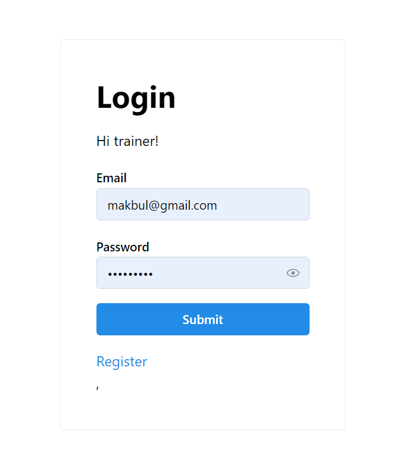
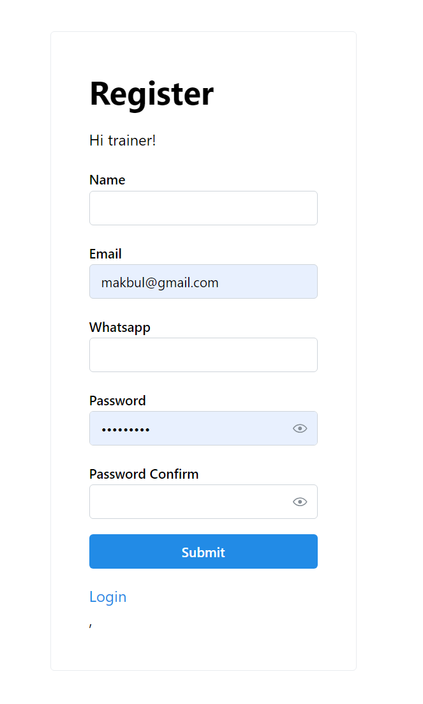

# What is this repo ?

This holds the source codes and configurations needed to run the Baret PT Web. The Web is a case study for the BelajarBerbagi - Sneak Peek Life At Tech Company Workshop. The code here is managed by git. The workshop utilizes git branches to load the appropriate state of the codebase to facilitate the demo and exercise for a given concept.

# The App

Please take a look at the docs folder in this repo for explainations of the app

# The Workshop

The main purpose of the workshop is to make the participants understand the day-to-day job of a Software Engineer at a Tech Company. I believe in the power of learning by doing. We learn so much more by actually just practicing rather by doing something else. You can think this workshop as a short Software Engineer internship at PT Muhammad Adnan R :D

The workshop consists of demo and exercises. The instructor will demonstrate a concept. Once the participants understood it. The participants are challenged to complete an exercise related to the concept.

The concepts are the hard skills most used by a Software Engineer during day-to-day job. Which are:

1. Understanding requirement + development
2. Testing
3. Documentation
4. Bug Fixing
5. Deployment

Enough reading, let's get our hands dirty!

## Preparation

Please follow this step to prepare the coding environment for the workshop:

1. In Sidebar click the Thunder Client button
2. Click `Env` in the appeared Thunder Client menu
3. Click the filter button
4. Import env variables, Development.postman_environment.json
5. Click `Collections` in the Thunder Client menu
6. Click the filter button
7. Import collection, Baret API.postman_collection.json

## Understanding Requirement + Development

Understanding requirement is a crucial part of a life as a Software Engineer. Because all software starts from defining the requirement of it. Misunderstanding in this step will lead in many errors along the next steps of developing a software

Development is an act of translating requirements into code that can be used (once deployed) by humans and/or other services. Backend is more about the latter. Backend services the Frontend

**Login UI Requirement**

**Login Requirement:**

- this is a protected route. only user that is logged in can use it
- can only create exercise on existing contract
- set exercise status of the created exercise to ACTIVE
- set the start time of the created exercise to the current time
- return the created exercise as success response

**Register UI Requirement**

**Register Requirement:**

- this is a protected route. only user that is logged in can use it
- validate password properly
- the new password must be encrypted before saving it to the database
- return user information as success response
- make sure no sensitive information in the success response

Instructor Demo: create exercise endpoint
Participant Challenge: change password endpoint

Demo Start Git Branch:
`git checkout 1-demo-requirement-dev-start`
Demo Solution Git Branch:
`git checkout 1-demo-requirement-dev-solution`

Exercise Start Git Branch:
`git checkout 1-exercise-requirement-dev-start`

Exercise Solution Git Branch:
`git checkout 1-exercise-requirement-dev-solution`

## Testing

Testing is the act of making sure our code works as expected

Instructor Demo: create integration test for App Switcher

Demo Start Git Branch:
`git checkout 2-demo-testing-start`
Demo Solution Git Branch:
`git checkout 2-demo-testing-solution`

## Documentation

Documentation is the act of having a form of media that explains the stuff needed for other Software Engineers to be able understand fully a piece of code

Instructor Demo: show complete documentation of Baret PT API

## Deployment

Deployment is the act of making our code ready to be used by humans and/or other services

**Steps to deploy**
Deployment can be done in any platform that supports SPA deployment, that is any static file hosting + routing config. To simplify things, deployment is going to be done in vercel.com:

1. Register to vercel.com
2. In terminal run, npx vercel --prod

Instructor Demo: show redeployment

## Bug Fixing

Bug fixing is the act of writing code to fix a unexpected behaviour of existing code

Instructor Demo: bug fix in create exercise endpoint
